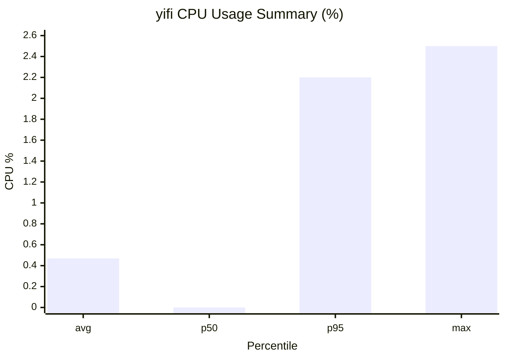
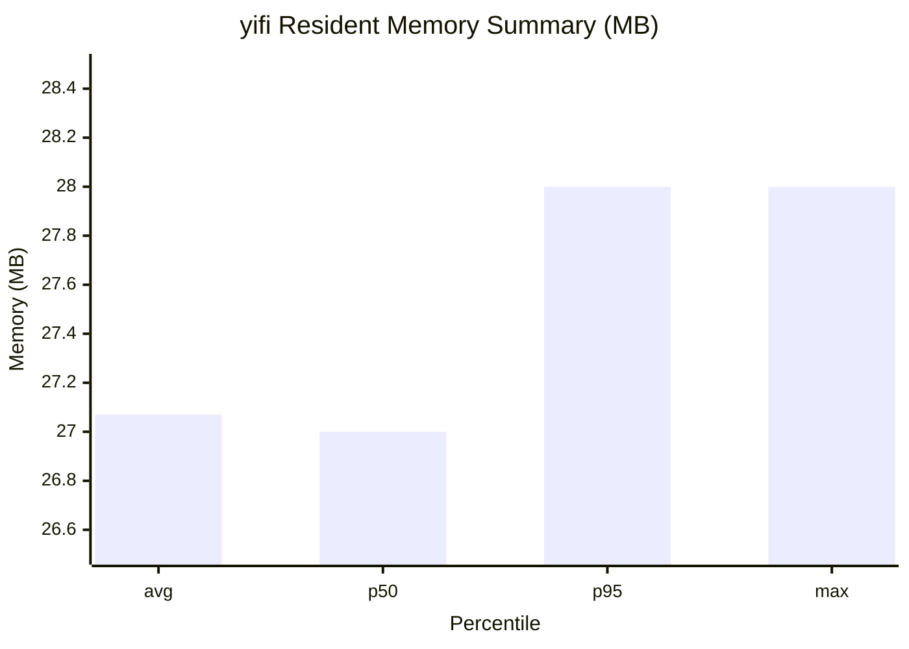

# 📶 Yifi

See what's slowing you down.

Yifi is a native macOS menu bar app with a minimal always-on footprint that monitors your network health in real time. It breaks your connection into clear sections so you can quickly find where problems start, whether that is your Wi-Fi signal, router, ISP, or DNS.

## Features

- Lives in your menu bar, always one click away and out of the way
- Real-time diagnostics update every 3 seconds across four key areas:
  - Connection to Router: link rate, signal strength, noise level
  - Inside Home Network: latency, jitter, and packet loss to your router
  - Connection to Internet: latency, jitter, and packet loss to the internet
  - Website Name Lookup: DNS resolution speed
- Color-coded status indicators: green, yellow, and red dots show what is healthy and what is not
- Sparkline charts: mini trend graphs for each metric so you can spot patterns over time
- Liquid Glass design with a native macOS look and feel

## Resource Footprint

Yifi is designed to stay in the menu bar all day with a small runtime footprint.

- Measured on a live `yifi` process using `top` (`61` samples at `1s` intervals over `60s`)
- CPU usage: `0.469%` average, `2.200%` p95, `2.500%` max observed
- Memory usage: `27.07 MB` average resident, `28.00 MB` p95/max observed
- Threads: typically single-digit

This is consistent with a native Swift/macOS background app that polls lightweight network diagnostics every few seconds.

### CPU Profile (60s, 1s interval)



### Memory Profile (60s, 1s interval)



## Requirements

- macOS 26.2 or later
- Location permission (required by macOS to access Wi-Fi information)

## Install with Homebrew

```bash
brew install --cask itsnauman/yifi/yifi
```

Yifi is distributed unsigned, so macOS will block it on first launch. Run this to fix it:

```bash
xattr -cr /Applications/yifi.app
```

## Building from Source

1. Clone the repository:
   ```bash
   git clone https://github.com/itsnauman/yifi.git
   cd yifi
   ```

2. Open in Xcode (26.3+):
   ```bash
   open yifi.xcodeproj
   ```

3. Build and run (`Cmd + R`). The app will appear in your menu bar.

Yifi has no third-party dependencies. It uses only Apple frameworks (SwiftUI, CoreWLAN, CoreLocation).

## Permissions

On first launch, Yifi will ask for location access. macOS requires this for any app that reads Wi-Fi network information. Yifi does not track or store your location.

## License

MIT
